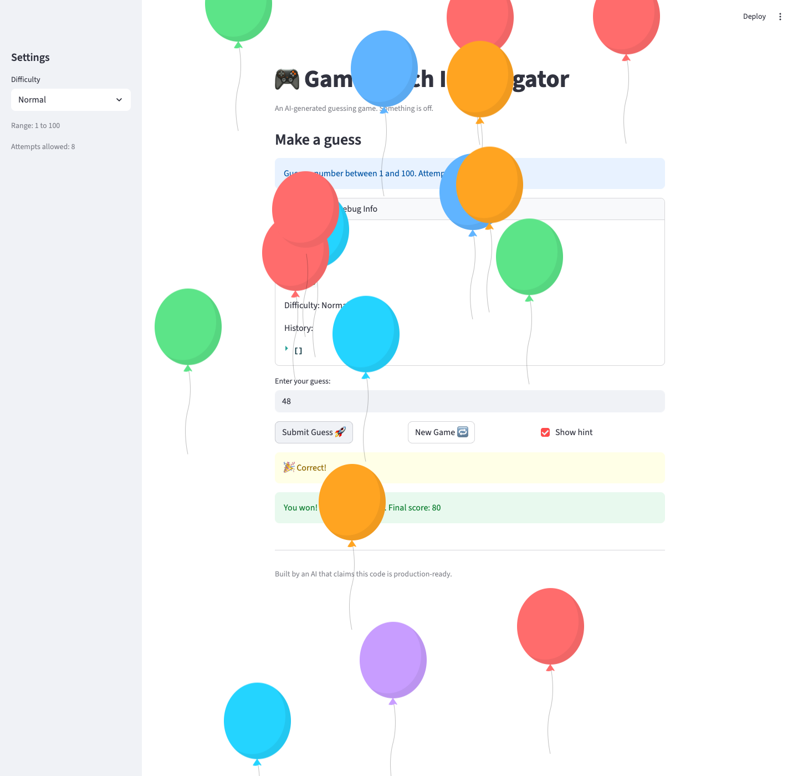
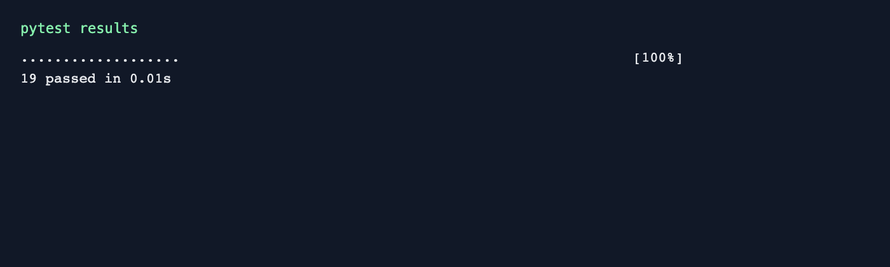

# 🎮 Game Glitch Investigator: The Impossible Guesser

## 🚨 The Situation

You asked an AI to build a simple "Number Guessing Game" using Streamlit.
It wrote the code, ran away, and now the game is unplayable. 

- You can't win.
- The hints lie to you.
- The secret number seems to have commitment issues.

## 🛠️ Setup

1. Install dependencies: `pip install -r requirements.txt`
2. Run the broken app: `python -m streamlit run app.py`

## 🕵️‍♂️ Your Mission

1. **Play the game.** Open the "Developer Debug Info" tab in the app to see the secret number. Try to win.
2. **Find the State Bug.** Why does the secret number change every time you click "Submit"? Ask ChatGPT: *"How do I keep a variable from resetting in Streamlit when I click a button?"*
3. **Fix the Logic.** The hints ("Higher/Lower") are wrong. Fix them.
4. **Refactor & Test.** - Move the logic into `logic_utils.py`.
   - Run `pytest` in your terminal.
   - Keep fixing until all tests pass!

## 📝 Document Your Experience

- Game purpose: This project is a Streamlit number-guessing game where the player tries to find a secret number within a limited number of attempts.

- Bugs found: The secret and game flow were unstable across reruns, the higher/lower hints were backwards, the app mixed string and integer comparisons, and New Game did not fully reset gameplay state.

- Fixes applied: I moved reusable logic into `logic_utils.py`, kept the secret value numeric on every turn, corrected the higher/lower hint messages, fixed the attempt counter, and reset the key game fields (`secret`, `status`, `history`, and `attempts`) on New Game.

## 📸 Demo

Winning game after the repairs:

Challenge 1: Advanced Edge-Case Testing

I added regression coverage for the corrected hint text and for mixed-type secret comparisons, then reran the full pytest suite.

## 🚀 Stretch Features

Challenge 4 was not completed for this submission.
